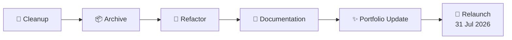

# 👋 Hi, I'm Uday

> ## 🚧 GitHub Profile Under Reconstruction

I'm currently reorganizing my GitHub to better reflect my recent work, open-source contributions, and professional experience.

### 🛠️ Reconstruction Status

```text
Overall Progress
███████████░░░░░░░░░ 55%

🧹 Repository Cleanup      ████████████████░░░░ 80%
📦 Archive Old Projects    ██████████████░░░░░ 70%
🔨 Refactoring             ████████░░░░░░░░░░░ 40%
📝 Documentation           ██████████░░░░░░░░░ 50%
✨ Portfolio Updates       ██████░░░░░░░░░░░░░ 30%
🎯 Final Organization      ██░░░░░░░░░░░░░░░░░ 10%
```



```text
⚠️ WARNING

▓▓▓▓▓▓▓▓▓▓▓▓▓▓▓▓▓▓▓▓▓▓▓▓▓▓▓▓

You may encounter:
◉ 🚧 Work in Progress
◉ 🐛 Random Bugs
◉ 🔗 Broken Links
◉ 📦 Repositories being Archived
◉ 🧩 Half-finished Projects

Proceed with curiosity. :)
```

---

### 📫 Connect

- 🌐 **Portfolio:** https://udayworks.me
- 📧 **Email:** udaysomapuram@gmail.com
- 💼 **LinkedIn:** https://linkedin.com/in/somapuram-uday
