```console
uday@builder-lab:~/projects$ ./identity.sh
============= [ BUILDER PROFILE LOADED ] =============
! USER_ID :   Somapuram Uday
! ROLE    :   Full Stack Engineer
! STATUS  :   Shipping > Planning
! FOCUS   :   AI Systems · Developer Tools · Verification Infrastructure

+ [0x01] MISSION
--------------------------------------------------------
  Problem   : Trust verification is slow. Developers repeat workflows.
              Automation is fragmented. Real-world systems fail silently.

  Building  : Systems that validate, automate, and survive production.
              Products that solve actual problems.

  Outcome   : Less manual work. More shipping.
              Code that works → users who stay.

+ [0x02] ACTIVE PROJECTS
--------------------------------------------------------
┌──────────────────────────────────────────────────────┐
│ PROJECT                PURPOSE                       │
├──────────────────────────────────────────────────────┤
│ CampusEventHub         Multi-tenant event platform   │
│                        (MERN: React + Node + MongoDB)│
│ Credify                Blockchain credential system  │
│ Credify Verify         Offline verification engine   │
│ GSSoC '26 OSS          Production-grade contrib.     │
│                        across 10+ repos              │
└──────────────────────────────────────────────────────┘

+ [0x03] ENGINEERING STACK
--------------------------------------------------------
  FRONTEND     React · Next.js · TypeScript · Tailwind
  BACKEND      Node.js · Express · Flask · REST APIs
  DATABASES    MongoDB · PostgreSQL · SQLite · Frappe
  AI/ML        OpenAI · Azure AI · NLP · LangGraph
  TOOLS        Git · Docker · Linux · Vitest
  CLOUD        Azure · Render · Vercel
  VERIFICATION Blockchain · IPFS · Docker

+ [0x04] BUILD PIPELINE (What Actually Ships)
--------------------------------------------------------
  [See interactive diagram below]

+ [0x05] OPEN SOURCE CONTRIBUTIONS (GSSoC '26)
--------------------------------------------------------
  High-Impact Repos:
  ├─ GSSoC_2026_DevCard         Lead contributor
  │  └─ Developer showcase tools & features
  │
  ├─ GGSoC_2026_urBackend        Backend features & testing
  │  └─ Production-grade API improvements
  │
  ├─ OSS_CampusEventHub          MERN platform deployment
  │  └─ Event management system (multi-tenant)
  │
  └─ Event-Management-System     Original OSS initiative
     ├─ Socket.IO fallback, attendee check-in
     ├─ Multi-repo coordination
     └─ Testing & documentation

+ [0x06] WHAT I BUILD
--------------------------------------------------------
  ✓ Full-stack MERN apps (React + Node + MongoDB)
  ✓ Frappe-based enterprise systems (RBAC, workflows, reporting)
  ✓ Verification & credential systems (blockchain-ready)
  ✓ Developer automation tools (CLI, API, testing)
  ✓ Production-ready code (tested, documented, shipped)
  ✓ Things that actually get used by real people

  ✗ Proof-of-concept code
  ✗ Half-finished side projects
  ✗ Complexity without purpose

+ [0x07] CURRENTLY LEARNING
--------------------------------------------------------
  ██████████░░  AI Engineering & LangGraph
  █████████░░░  Azure AI & Production ML
  ████████░░░░  System Design at Scale
  ███████░░░░░  Distributed Systems

+ [0x08] LINKS & PRESENCE
--------------------------------------------------------
  PORTFOLIO    → https://udayworks.me
  GITHUB       → https://github.com/udaycodespace
  
  PROJECTS     → 
    ├─ CampusEventHub → https://github.com/udaycodespace/OSS_CampusEventHub
    ├─ GSSoC DevCard  → https://github.com/udaycodespace/GSSoC_2026_DevCard
    ├─ urBackend      → https://github.com/udaycodespace/GGSoC_2026_urBackend
    ├─ Credify        → https://github.com/udaycodespace/credify
    └─ All OSS Repos  → https://github.com/udaycodespace?tab=repositories&q=GSSoC
  
  SOCIAL       →
    ├─ LinkedIn  → https://linkedin.com/in/somapuram-uday
    └─ Email     → Available on portfolio

========================================================
PHILOSOPHY
"Ship useful things. Test them. Iterate fast.
 Clarity beats complexity. Users decide success."

BUILD METRICS (2026)
├─ Open Source Contributions    : Active GSSoC '26
├─ Production Code Shipped      : 40+ repos
├─ Users Impacted              : 1000+ (direct & indirect)
├─ Code Quality               : Tested, documented, peer-reviewed
└─ Uptime Philosophy          : Build to last, not build to fail
========================================================
```

---

## 🔄 BUILD PIPELINE (Interactive)

```mermaid
graph LR
    A["💡 Idea<br/>5 min"] -->|Think & Plan| B["⚙️ Prototype<br/>1-2 days"]
    B -->|Code & Test| C["👥 Real Users<br/>Day 1"]
    C -->|Deploy Early| D["💬 Feedback<br/>Live"]
    D -->|Listen & Learn| E["🔄 Iteration<br/>Continuous"]
    E -->|Polish & Improve| F["🚀 Production<br/>Ship It"]
    
    style A fill:#4a5568,stroke:#48bb78,color:#fff
    style B fill:#4a5568,stroke:#48bb78,color:#fff
    style C fill:#4a5568,stroke:#48bb78,color:#fff
    style D fill:#4a5568,stroke:#48bb78,color:#fff
    style E fill:#4a5568,stroke:#48bb78,color:#fff
    style F fill:#4a5568,stroke:#38a169,color:#fff
```



**No overthinking. No 6-month plans. Just ship.**

---

## 🚀 Quick Links

| Project | Link | Status |
|---------|------|--------|
| **CampusEventHub** | [github.com/udaycodespace/OSS_CampusEventHub](https://github.com/udaycodespace/OSS_CampusEventHub) | Production |
| **GSSoC DevCard** | [github.com/udaycodespace/GSSoC_2026_DevCard](https://github.com/udaycodespace/GSSoC_2026_DevCard) | Active |
| **urBackend** | [github.com/udaycodespace/GGSoC_2026_urBackend](https://github.com/udaycodespace/GGSoC_2026_urBackend) | Active |
| **Credify** | [github.com/udaycodespace/credify](https://github.com/udaycodespace/credify) | Production |
| **Portfolio** | [udayworks.me](https://udayworks.me) | Live |
| **LinkedIn** | [linkedin.com/in/somapuram-uday](https://linkedin.com/in/somapuram-uday) | Connected |

---

## 💼 Let's Build Something

Full-stack MERN, AI systems, blockchain verification, or just shipping code that works.

👉 **[Portfolio](https://udayworks.me)** · **[GitHub](https://github.com/udaycodespace)** · **[LinkedIn](https://linkedin.com/in/somapuram-uday)**
