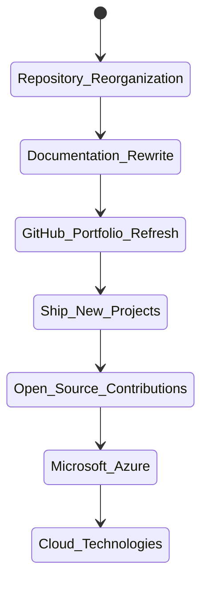
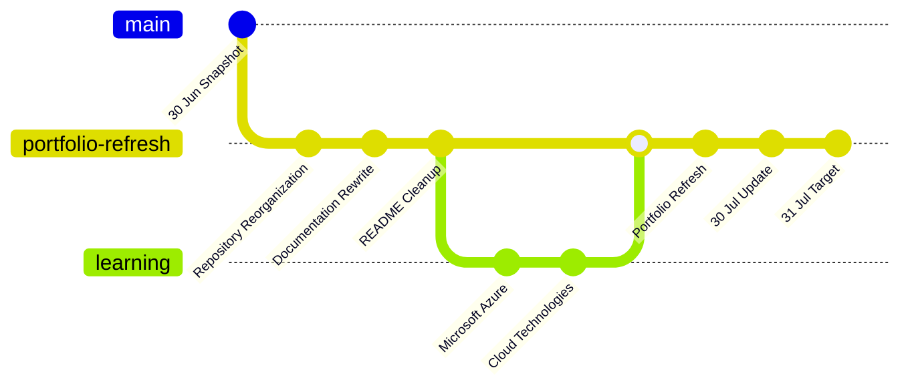
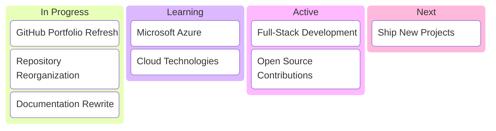
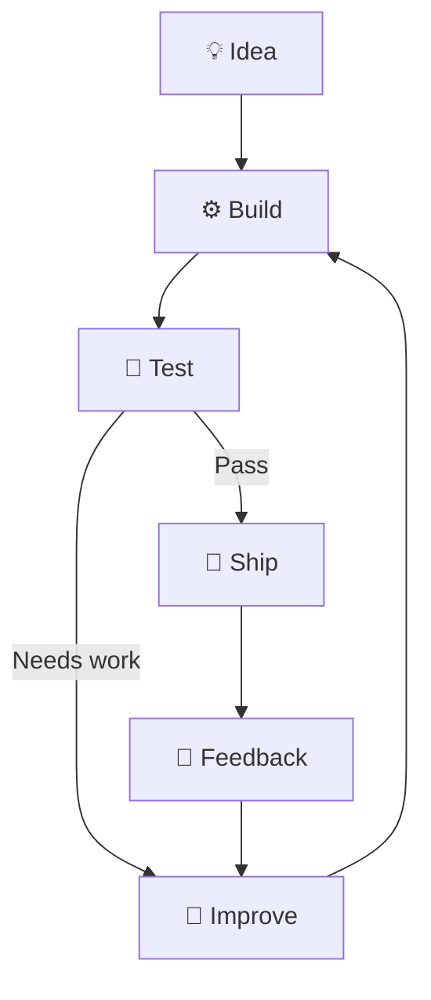

<div align="center">

<pre>
┌────────────────────────────────────────────────────────────────────────────┐
│                                                                            │
│                          HI 👋, I'M SOMAPURAM UDAY                         │
│                                                                            │
│              Full-Stack Developer • Open Source Contributor                │
│                                                                            │
└────────────────────────────────────────────────────────────────────────────┘
</pre>

</div>

```console
uday@github:~$ ./whoami

==============================================================
                 DEVELOPER PROFILE LOADED
==============================================================

USER          : Somapuram Uday
ROLE          : Full-Stack Developer
LOCATION      : India
STATUS        : ONLINE

LAST UPDATE   : 30 Jun 2026
NEXT UPDATE   : 30 Jul 2026

CURRENT GOAL  : Rebuild GitHub Portfolio
TARGET DATE   : 31 Jul 2026

==============================================================
[0x01] ACTIVE PROCESSES
--------------------------------------------------------------

 PID    PROCESS                              STATUS
──────────────────────────────────────────────────────────────
1001    Full-Stack Development               RUNNING
1002    GitHub Portfolio Refresh             RUNNING
1003    Repository Reorganization            RUNNING
1004    Documentation Rewrite                RUNNING
1005    Microsoft Azure                      LEARNING
1006    Cloud Technologies                   LEARNING
1007    Open Source Contributions            ACTIVE

==============================================================
[0x02] CURRENT FOCUS
--------------------------------------------------------------

 > Reorganizing repositories
 > Improving project documentation
 > Learning Microsoft Azure
 > Learning cloud technologies
 > Contributing to open source
 > Building software that solves real-world problems

==============================================================
```

## Workflow



## Portfolio Refresh



## Priorities



## Development Cycle



> *Currently cleaning up years of repositories because "I'll organize them later" eventually became a milestone.*
