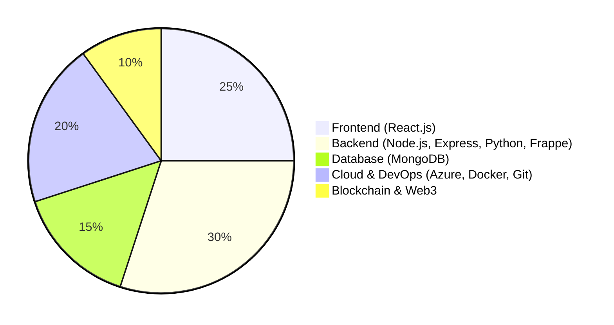
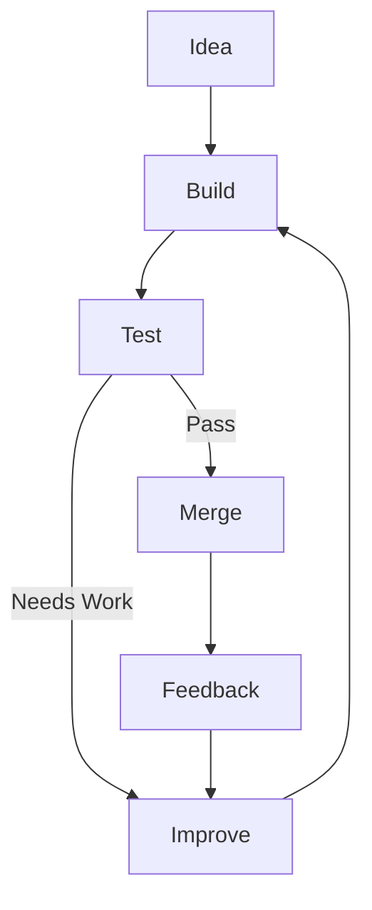

<div align="center">

<pre>
╭──────────────────────────────────────────────────────────────╮
│                                                              │
│                 HI 👋, I'M SOMAPURAM UDAY                    │
│                                                              │
│          Full-Stack Developer • Open Source Contributor      │
│                                                              │
╰──────────────────────────────────────────────────────────────╯
</pre>

</div>

```console
uday@github:~$ ./whoami

==================================================
              DEVELOPER PROFILE LOADED
==================================================

USER        : Somapuram Uday
ROLE        : Full-Stack Developer
LOCATION    : India
STATUS      : ONLINE

GSSOC 2026  : Top 1.0% Globally | 50+ PRs | 7 Repos

==================================================
[0x01] ACTIVE PROCESSES
==================================================

PID     PROCESS                              STATUS
--------------------------------------------------
1001    Full-Stack Development               RUNNING
1002    Open Source Contributions             ACTIVE
1003    GitHub Portfolio Refresh              RUNNING
1004    Repository Reorganization             RUNNING
1005    Documentation Improvements            RUNNING
1006    Cloud Technologies                    LEARNING

==================================================
[0x02] CURRENT FOCUS
==================================================

> Leading LearnHub as ECSoC 2026 Project Admin
> Contributing to open source through GSSoC & ECSoC
> Building scalable full-stack applications
> Learning Azure Cloud and DevOps

==================================================
[0x03] OPEN SOURCE IMPACT (GSSoC '26)
==================================================

GLOBAL RANK    : Top 1.0% Rank 🏆
REPOS ENGAGED  : 10+ Open-Source Codebases
PR STATUS      : 50+ Contributions Merged
Focus Areas    : Robust QA, Security Hardening, Feature Engineering, Refactoring

```

## Snapshot

<div align="center">


</div>

## Technologies I Work With 



## Featured Projects

| Project | Description | Technologies |
|---------|-------------|--------------|
| [LearnHub](https://github.com/udaycodespace/learnhub) | MERN e-learning platform with dashboards for students, teachers, and admins. I'm the Project Admin for its ECSoC 2026 run. | React · Node.js · Express · MongoDB · Material UI |
| [Credify](https://github.com/udaycodespace/credify) | Permissioned blockchain platform for tamper-evident academic credential issuance and verification | Python · Flask · IPFS · Docker |
| [CampusEventHub](https://github.com/udaycodespace/CampusEventHub) | Full-stack MERN platform for inter-college event management with role-based dashboards and JWT authentication | React · Node.js · Express · MongoDB |

### Contribution Distribution

```text
Testing & QA                  40%  ████████████████████
Features & UI Design          25%  ████████████
Performance & Refactoring     15%  ████████
Security Hardening            10%  █████
Documentation & Bug Fixes     10%  █████
```

### Notable Contributions

| Repository | Contribution Type | Highlight / Impact |
| --- | --- | --- |
| **[Dev-Card/DevCard](https://www.google.com/search?q=https://github.com/Dev-Card/DevCard)** | `Feature` · `Testing` · `Performance` | Shipped critical Dev-Card feature iterations with `quality:exceptional` tags and robust automated test configurations. |
| **[JhaSourav07/commitpulse](https://github.com/JhaSourav07/commitpulse)** | `Testing` · `Bug Fix` · `Refactor` | Scaled test coverage exponentially across multiple PRs with rigorous, high-quality test suites and optimized dashboard code. |
| **[nevinshine/telos-runtime](https://github.com/nevinshine/telos-runtime)** | `Security` · `Feature` · `Refactor` | Patched critical runtime network vulnerability hooks (DNS profiling) and refactored core runtime feature components. |
| **[anubhavxdev/Event-Management](https://github.com/anubhavxdev/Event-management-system-main)** | `Feature` · `Security` · `Performance` | Shipped multi-role security configurations, core event workflows, and optimized UI rendering state logic. |
| **[geturbackend/urBackend](https://www.google.com/search?q=https://github.com/geturbackend/urBackend)** | `Bug Fix` · `Refactor` · `Docs` | Fixed core authentication/token validation loops, refactored API error handlers, and improved structural technical onboarding documents. |


## My Workflow



> Currently cleaning up years of repositories because "I'll organize them later" became a full-scale project.
