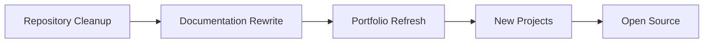
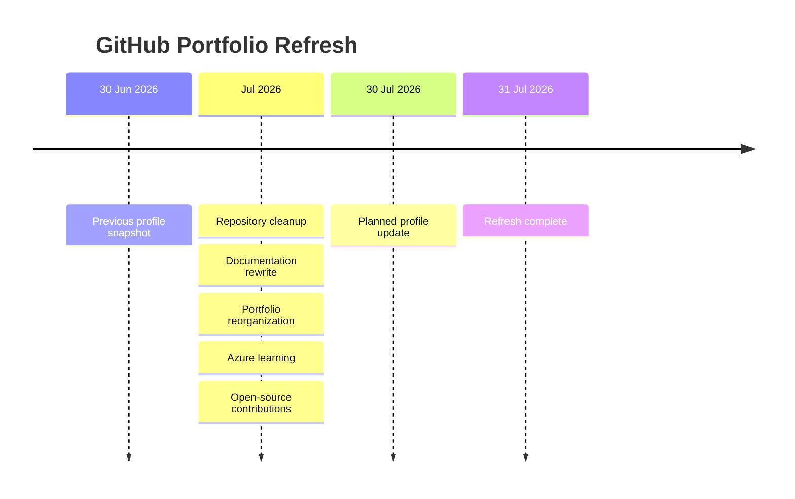
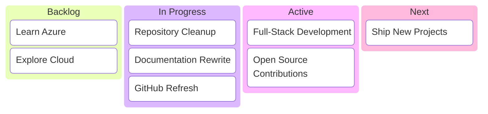
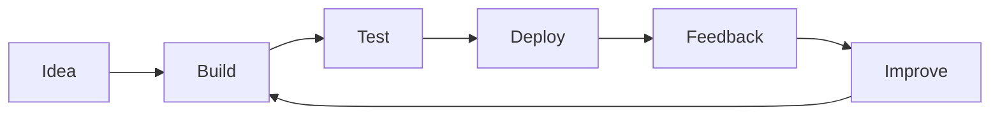

# Hi, I'm Somapuram Uday

```console
uday@github:~$ ./whoami

==============================================================
                 DEVELOPER PROFILE LOADED
==============================================================

USER          : Somapuram Uday
ROLE          : Full-Stack Developer
LOCATION      : India
STATUS        : ONLINE

LAST UPDATE   : 30 Jun 2026
NEXT UPDATE   : 30 Jul 2026

CURRENT GOAL  : Refresh GitHub Portfolio
TARGET DATE   : 31 Jul 2026

==============================================================
[0x01] ACTIVE PROCESSES
--------------------------------------------------------------

 PID    PROCESS                              STATUS
──────────────────────────────────────────────────────────────
1001    Full-Stack Development               RUNNING
1002    GitHub Portfolio Refresh             RUNNING
1003    Repository Cleanup                   RUNNING
1004    Documentation Rewrite                RUNNING
1005    Microsoft Azure                      LEARNING
1006    Cloud Technologies                   LEARNING
1007    Open Source Contributions            ACTIVE

==============================================================
[0x02] CURRENT FOCUS
--------------------------------------------------------------

 > Organizing repositories
 > Improving project documentation
 > Learning Microsoft Azure
 > Exploring cloud technologies
 > Contributing to open source
 > Building software that solves real-world problems

==============================================================
```

---

## Current workflow



---

## Portfolio refresh timeline



---

## Current priorities



---

## Development cycle


